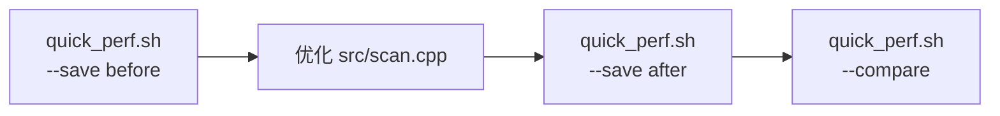

# 扫描性能基准测试 (Scan Benchmarks)

基于 [Google Benchmark](https://github.com/google/benchmark) 的性能测试,用于度量
`MemoryScanner::scanExact` 的扫描性能,并量化优化前后的提升。

## 目录内容

| 文件                              | 说明                                               |
| --------------------------------- | -------------------------------------------------- |
| `scan_benchmark.cpp`              | benchmark 入口、上下文信息和 `main()`              |
| `scan_benchmark_helpers.hpp/.cpp` | 数据生成、基线算法和公共报告工具                   |
| `scan_exact_benchmark.cpp`        | 常规内存扫描、基线算法和正确性守卫                 |
| `large_region_benchmark.cpp`      | 500 MiB 进程 region 读取与扫描场景                 |
| `quick_perf.sh`                   | 一键构建 + 运行 + 打印表格 + 前后对比的快捷脚本    |
| `compare.py`                      | 解析 JSON 结果,打印吞吐量表 / 加速比对比           |
| `CMakeLists.txt`                  | 构建配置,通过 `-DMEMSEEK_BUILD_BENCHMARKS=ON` 启用 |

## 快速开始

```bash
# 一键运行,直接打印可读表格
./benchmarks/quick_perf.sh
```

输出示例:

```
==> 运行扫描性能基准 (BM_ScanExact) ...

基准场景                                               耗时          吞吐量
----------------------------------------------------------------------
BM_ScanExact_U32_Random                        2.15 ms    1.82 Gi/s
BM_ScanExact_U32_Adversarial                   5.37 ms   744.7 Mi/s
...
```

## 优化工作流(测出性能提升)



```bash
./benchmarks/quick_perf.sh --save before    # 优化前存档到 .benchmarks/before.json
# 修改 src/scan.cpp,重新优化算法...
./benchmarks/quick_perf.sh --save after     # 优化后存档
./benchmarks/quick_perf.sh --compare        # 打印每个场景的加速比
```

`--compare` 输出示例:

```
基准场景                                          之前        之后       提升
----------------------------------------------------------------------------
BM_ScanExact_U32_Random                    2.23 ms     1.10 ms     2.03x
  └ 吞吐量变化                               1.75 Gi/s   3.55 Gi/s   +102.9%
----------------------------------------------------------------------------
平均加速比: 2.01x
```

- 提升以绿色显示(≥ 1.05x),退步以红色显示(≤ 0.95x),其余为噪声级别
- 同时打印吞吐量(Gi/s)变化百分比,便于跨场景横向比较

### 其他选项

```bash
./benchmarks/quick_perf.sh --filter BM_ScanExact_U32_Random   # 只跑指定基准
./benchmarks/quick_perf.sh --compare before.json after.json   # 自定义两个文件对比
```

## 基准场景说明

所有 `BM_ScanExact_*` 基准均直接调用本项目 `MemoryScanner::scanExact`
(即 `src/scan.cpp` 中的真实实现)。性能提升有两个参照维度:

1. **自身对比**:同一份代码优化前后各跑一次
   (`--save before` → 改代码 → `--save after` → `--compare`),
   看自己改动的收益;
2. **成熟工具对比**:`BM_BaselineMemmem*` 基准使用系统的 glibc
   `memmem`(经过高度优化的 Two-Way 算法)作为成熟扫描工具的参照,
   衡量自己与业界水平的差距。

| 基准                               | 数据特征                                | 度量目的                          |
| ---------------------------------- | --------------------------------------- | --------------------------------- |
| `BM_ScanExact_U32_Random`          | 随机 4 MiB,几乎无匹配                   | 典型场景吞吐量(自己的实现)        |
| `BM_ScanExact_U32_Adversarial`     | 缓冲区全部为模式首字节                  | 最坏情况:首字节预过滤完全失效     |
| `BM_ScanExact_U32_AllMatches`      | 缓冲区全部命中                          | 结果构建开销占主导的场景          |
| `BM_ScanExact_String16_Random`     | 16 字节长模式                           | 模式长度扩展性                    |
| `BM_ScanExact_U32_SizeScaling`     | 1/4/16 MiB                              | 缓存行为随缓冲区大小的变化        |
| `BM_BaselineMemmem_U32Random`      | 同 Random 场景                          | 成熟工具参照:glibc memmem         |
| `BM_BaselineMemmem_String16Random` | 同 String16 场景                        | 成熟工具参照:glibc memmem         |
| `BM_ScanExact_CorrectnessGuard`    | 内嵌已知模式并校验结果                  | 防止"越优化越错"的正确性守卫      |
| `BM_ScanExact500MiBInMemory`       | 已在当前进程中准备 500 MiB 的随机数据   | 只测扫描算法吞吐量                |
| `BM_Read500MiBProcessRegion`       | 使用 `process_vm_readv` 读取上述 region | 测量进程内存读取吞吐量和 peak RSS |
| `BM_ScanExact500MiBProcessRegion`  | 读取指定 region 后执行扫描              | 测量真实 region 扫描端到端性能    |

500 MiB 场景会在 benchmark 进程中保留一块随机填充的内存，并在其中植入 3 个
`uint32_t` 目标值。相关 benchmark 固定执行一次，避免基准框架为了达到最小测量时间
而重复分配和读取数百 MiB 数据。`peak_rss_mib` 是进程运行期间观测到的峰值 RSS，
主要用于观察进程读取带来的额外内存占用。

## 手动使用(Google Benchmark 原生方式)

> 注意:直接运行 `./scan_benchmark` 输出的是 Google Benchmark 的**原始数据**,
> 没有汇总表格和前后对比。日常分析请优先使用 `./benchmarks/quick_perf.sh`。

```bash
cmake -B build -DMEMSEEK_BUILD_BENCHMARKS=ON -DCMAKE_BUILD_TYPE=Release
cmake --build build --target scan_benchmark --parallel

cd build/benchmarks
./scan_benchmark                                    # 全部运行(原始输出)
./scan_benchmark --benchmark_filter='BM_ScanExact'  # 只测自己的实现
./scan_benchmark --benchmark_list_tests             # 列出所有基准
```

使用 `compare.py` 对比优化前后两次自己实现的 JSON 结果:

```bash
python3 benchmarks/compare.py build/benchmarks/before.json build/benchmarks/after.json
```

## 注意事项

- **务必使用 Release 构建**(`-DCMAKE_BUILD_TYPE=Release`),Debug 数据无参考意义
- 脚本会自动以 `Release` 配置主 `build/` 目录,并启用 `MEMSEEK_BUILD_BENCHMARKS`
- 基准结果保存在 `.benchmarks/`(已加入 `.gitignore`)
- 短时间多次运行会有 ±5% 左右的噪声;判断提升时以 `--compare` 中多个场景
  一致的方向为准,单个小幅波动不算数
- 依赖(google/benchmark)通过 FetchContent 首次配置时联网下载,之后离线可用
